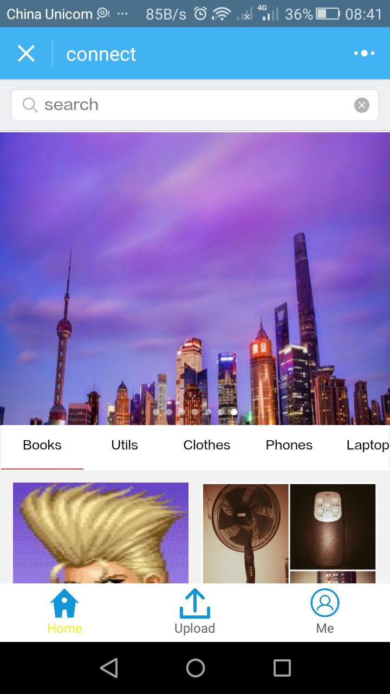
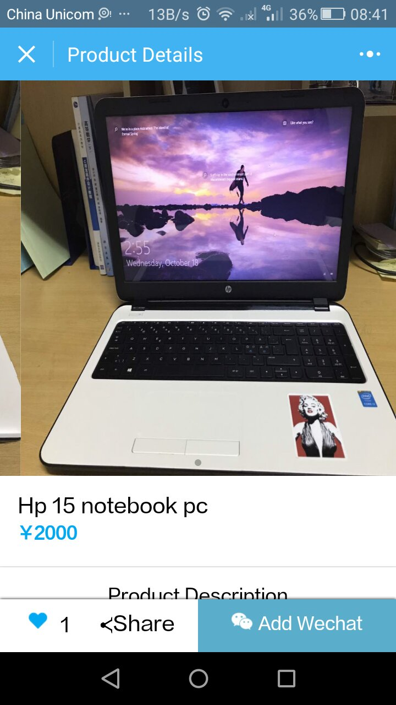
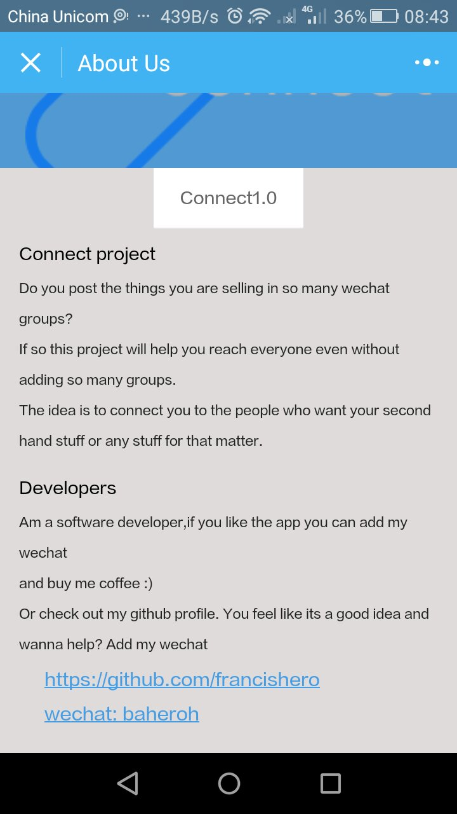
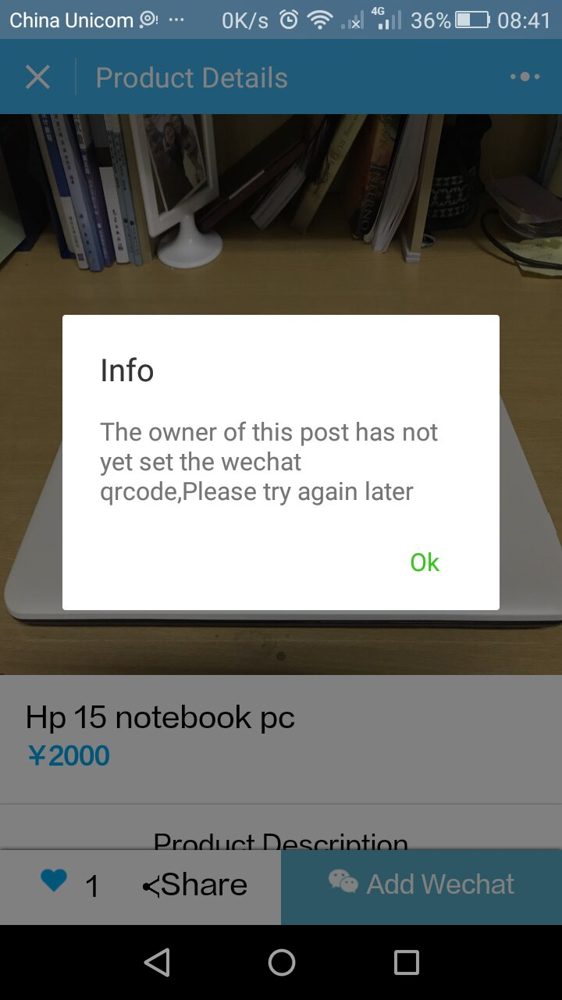

# connect-wechat-mini-app
> A wechat mini app to help international students at my university in china sell second hand stuff.
The app runs in wechat as a mini program and connects international students who sell and buy second hand stuff.
It uses wechat qrcode to connect the seller and buyer.
A seller uploads his product to the mini app then a buyer can connect to him using the qrcode.
## Installing / Getting started
To run the project you will need wechat devtools

## Developing
To develop the app you will need to connect to the backend of the api. A restiful api written in nodejs here is the backend [backend](https://github.com/francishero/connect-restiful-api)### Built With
Javascript, wechat's own mockup language
### Prerequisites
You must atleast have wechat devtools installed

## Screenshot

---

## License 

MIT